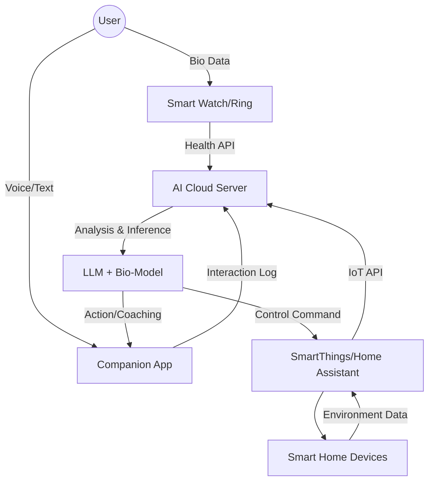

# 04. IoT & Data Architecture: The Nervous System

> **개요**: AI 컴패니언이 사용자의 생체 신호(Bio)와 생활 환경(IoT)을 인지하고 처리하는 기술적 구조.

## 1. System Architecture Overview

## 2. Key Components

### A. Bio-Sensor Integration Layer
*   **Source**: Apple HealthKit, Google Fit, Oura Cloud API.
*   **Key Metrics**:
    *   **Heart Rate Variability (HRV)**: 스트레스 지수 실시간 모니터링.
    *   **Sleep Quality**: 깊은 수면, 렘 수면 비율 분석 -> 아침 기상 멘트 차별화.
    *   **Activity Level**: 걸음 수, 운동량 -> "오늘은 좀 더 움직여볼까요?" 제안.

### B. IoT Context Layer
*   **Protocol**: Matter, Zigbee, Wi-Fi through Hub API.
*   **Sensors**:
    *   **Motion Sensor**: 재실 여부, 활동 패턴 파악.
    *   **Door/Window Sensor**: 외출/귀가 인식 -> "다녀오셨어요?" 타이밍 최적화.
    *   **Lights/Plug**: 수면 환경 조성 (조도 조절, 가습기 전원 제어).

### C. Privacy & Edge Processing
*   **Data Minimization**: 민감한 생체/영상 데이터는 **Edge Device (스마트폰/홈 허브)**에서 1차 가공 후, 익명화된 Feature Vector만 클라우드로 전송.
*   **Local LLM**: 간단한 일상 대화나 즉각적인 IoT 제어는 온디바이스 AI로 처리하여 지연 시간 최소화 및 보안 강화.

## 3. Pre-emptive Data Schema (For Future Robots)

미래 휴머노이드를 위한 데이터 표준화 (Standardization)

| Field | Description | Future Robot Use Case |
| :--- | :--- | :--- |
| **User_State_Vector** | [Emotional_Valence, Energy_Level, Hunger_Score, Social_Battery] | 로봇의 접근 방식 결정 (조용히 다가갈지, 활기차게 인사할지) |
| **Home_Map_Graph** | {LivingRoom: [Sofa, TV, Lamp], Kitchen: [Table, Fridge]} | 로봇의 이동 동선(Navigation) 및 객체 상호작용 계획 |
| **Routine_Sequence** | [WakeUp(07:00) -> Toilet -> Kitchen(Water) -> Exercise] | 로봇의 예측형 서비스 제공 (미리 물 떠놓기) |
